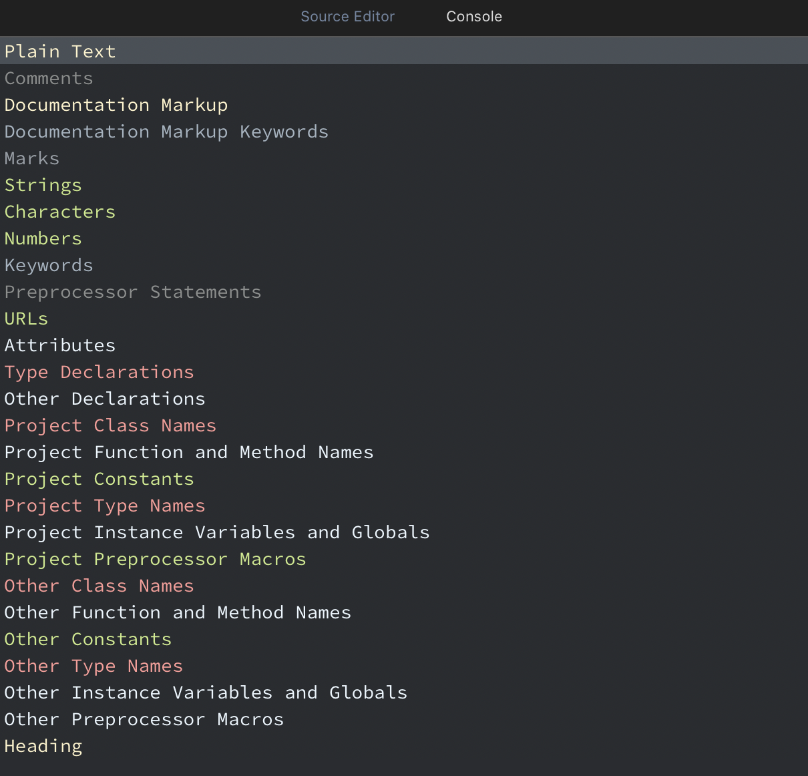

# Subtle Xcode theme

Subtle Xcode theme is best for those who don't prefer vibrant colors. Helps reduce stress on your eyes while working long hours.



## 📦 Install using Swift Package Manager

The easiest way to install this Xcode theme is to clone this repo and execute `swift run`:

```
$ git clone https://github.com/arnrdy/subtle-xcode
$ cd subtle-xcode
$ swift run
```

This will install [Adobe's Source Code Pro](https://github.com/adobe-fonts/source-code-pro) font and this Xcode theme for you. Afterward, you can remove the downloaded folder:

```
$ cd ..
$ rm -rf subtle-xcode
```

## 👨‍💻 Install manually

1. Clone this repo:
```
$ git clone https://github.com/arnrdy/subtle-xcode
```

2. Create a folder at this path if it doesn't exist already:
```
~/Library/Developer/Xcode/UserData/FontAndColorThemes
```

3. Copy the file `Subtle.xccolortheme` into the above folder.

4. Download the latest release of Source Code Pro from [its repo](https://github.com/adobe-fonts/source-code-pro).

5. Unzip the font archive and move the files in the `TTF` folder to `~/Library/Fonts`.

## Credits

Most of the colors used are from the Open Source Color Scheme - https://github.com/yeun/open-color

Installation script and README are taken and partially modified from https://github.com/JohnSundell/XcodeTheme